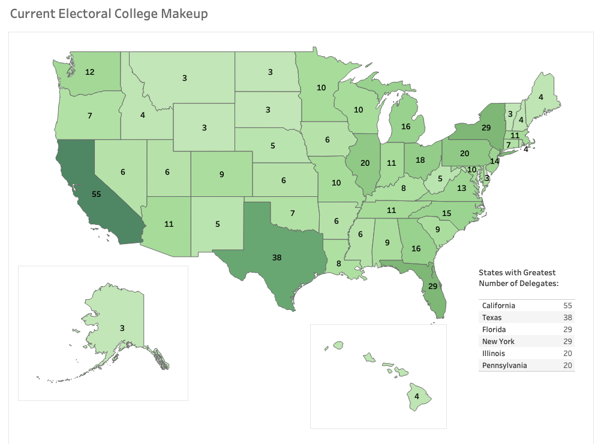
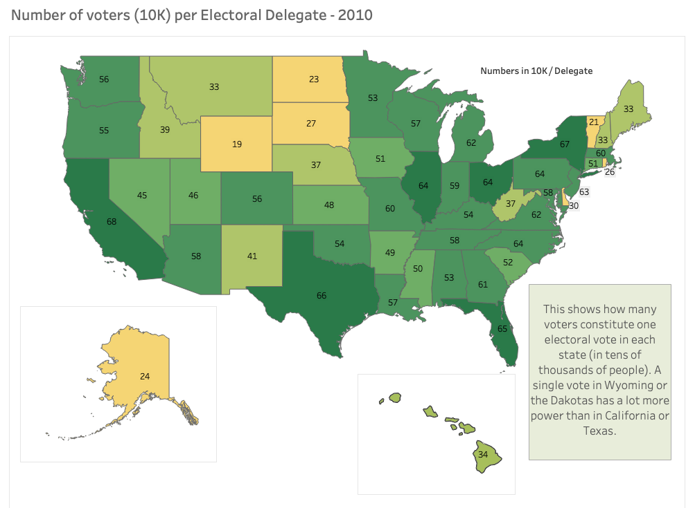
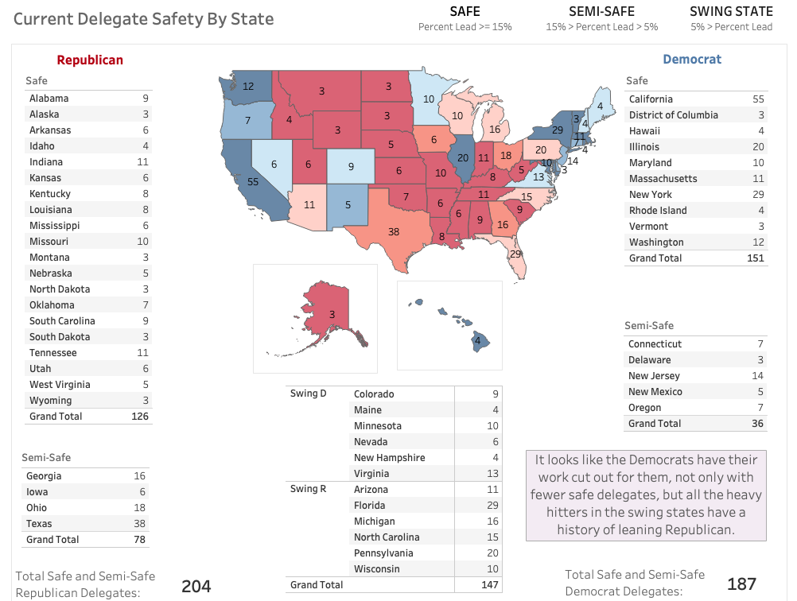
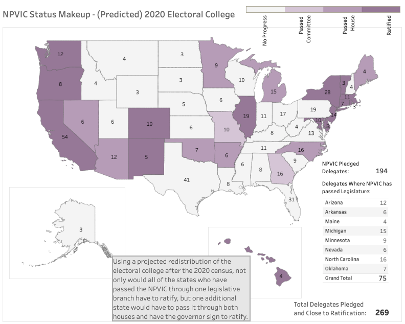

# The Electoral College of Today and Tomorrow

### An exploration of the electoral college, the history of presidential elections, and how the future electoral college will shape our elections

The United State electoral college is a bit of a funny system. We don't elect our presidents based solely on how much of the country wants a particular candidate in office, but rather how much each weighted (sort of) state wants a candidate in office. Each state has a number of electoral votes, assigned by the Census Bureau after each election, which is effectively the number of house seats a state gets plus two (so minimum 3), and then DC (who has no representative) gets 3 as well. The system has come under some scrutiny lately, as two of our three most recent presidents (George W. Bush and Donald Trump) were sent to office by the electoral college, despite the fact that they did not have a majority of support nationwide. What are the stakes today, what will they look like tomorrow, and can we just throw it all away and elect via a national popular vote instead?

The purpose of this project was to analyze the how the electoral college votes were distributed after the 2010 census, look at how the redistribution of population (by estimate) has shifted over time until today, and what that meant for electoral votes per capita in each state. I also analyzed how we expect the electoral college to be redistributed after the 2020 census, given census bureau estimates and my own predictions for 2020 state populations.

I also looked at the percentage likelihood of each state giving its electoral college votes to a particular party (and their respective nominees). The aim was to show which states have the greatest power per vote, given both their current electoral votes allotted and the likelihood of that state assigning their votes to either party.

I needed a variety of data for completing this project. First and most importantly, I used the Census Bureau's API to get population data from the 2010 census, and the bureau's estimates (based on smaller surveys done each year) for how populations are changing state by state, year by year.

I also had to pull down the overseas population for each state, which was only recorded in the 2010 census, but had no estimates for 2011 - 2019. As the total population (in US + overseas) is what's used to calculate electoral vote apportionment, I used the percent change in population from year to year, state by state, and interpolated the overseas population through 2019 by that same amount.

I also pulled in a .csv of historical presidential elections from the MIT Election Lab. It wasn't the cleanest format, so I re-organized the data to have each line be the status for one year and state, with only data present for the two major parties, as well as the total number of voters across all candidates in that state for that year.

Finally, I wanted to look at the NPVIC, and how close (if at all) we are to that compact becoming a reality. Using https://www.nationalpopularvote.com/state-status as my source, which updates as states move the NPVIC forward through committee, to legislature, and finally ratification by the governor, I web-scraped the status for each state and converted it to a numerical value for analysis.

Once I had all my data, there were two big predictions I wanted to make: population and electoral votes. First, I predicted what the population in each state would be after the 2020 census completed. I used Facebook Prophet and iterated through each state to find a prediction for the population of that state given recent trends. I then tested my apportionment algorithm (which uses the same format the Census uses, the reciprocal of the geometric mean) against the actual apportionment by the Census Bureau, and *VOILA* it worked perfectly! I used this algorithm to apportion house seats (and consequently, electoral votes) for the predicted populations of each state, and saved it all to .csv files for analysis in Tableau!

For more information on the reciprocal of the geometric mean, and the mathematics the Census Bureau uses for apportionment, see this link: https://www.census.gov/population/apportionment/about/computing.html

I used Tableau to analyze all this data I had collected, interpolated, and predicted. Select dashboards can be seen below, though I encourage you to look at the full story on Tableau Public to get a real picture of the electorate from 2010 to today, and what the future holds.

This is what the electoral college looks like today:

But as we can see, even though states like California and Texas have a large impact on the electoral college, individual voters there have very diluted voices. This is a picture of voter potency (aka electoral votes per capita) directly after reapportionment from the 2010 census. A single vote has much more impact in Wyoming and the Dakotas than anywere else (represented both in color and by the lower electoral vote/capita score)

What's the current state of the parties though, and how safe are they in states across the US? How close to the required 270 electoral votes is each party given stats from the most recent election? As you can see here, Democrats are behind Republicans in how many votes they have from safe states, and have an uphill battle when it comes to getting enough votes from swing states to win the election.

What if we just got rid of this whole system though? While an amendment to the constitution for a national popular vote election would be long, arduous, and unlikely, a number of states are signing the National Popular Vote Interstate Compact, or the NPVIC, which aims to use the electoral system against itself to implement a national popular vote. The compact states that once enough states have signed whose electoral votes add up to 270 (the amount needed to win an election), the compact will take effect. Every state who has signed the compact will send all of their electoral votes to whomever wins the *national* popular vote, not whomever wins that state's individual popular vote. It has a solid constitutional footing (the constitution allows for delegates to vote however they choose, though by convention it's been however the state voted) and could really change the dynamic of elections in the US.

Sadly, given how the electorate is predicted to change after the 2020 census, even if all the states who have passed the NPVIC through their legislature were to have it fully ratified, the compact falls **one** vote short of being enacted. That means a state who has only passed the NPVIC through committee would have to pass it through two state legislative houses AND have the governor ratify for it to be enacted in an election. Could this happen by 2024? Possibly, though unlikely. We'll probably have to wait until at least 2028 before this could become a reality. For now, we're stuck with our election system as is.

For the full story, please visit:

https://public.tableau.com/profile/jeremy.owens#!/vizhome/Electoral_College_Analysis_Prediction/ElectoralCollegeStory

And check out my other visualizations on my profile page:

https://public.tableau.com/profile/jeremy.owens#!/

